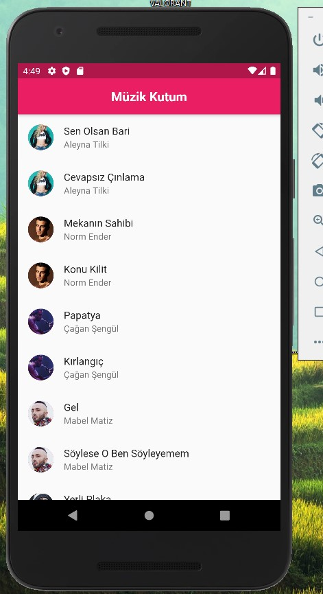
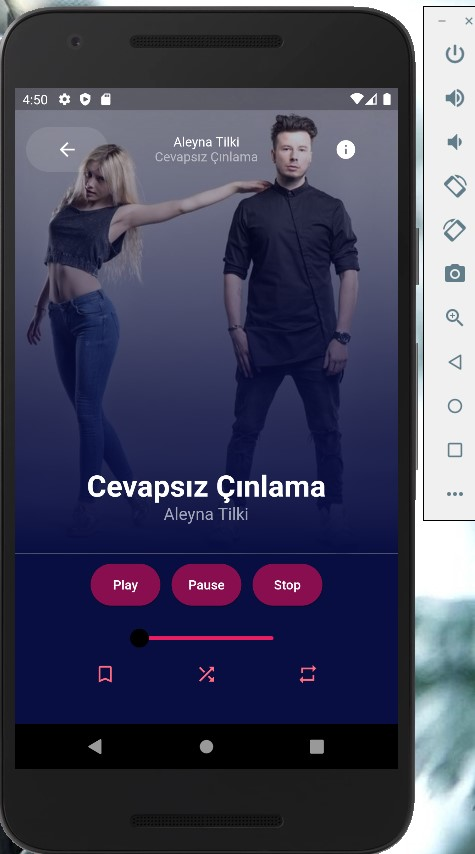

# Flutter Dart Müzik Oynatıcı Projesi

Uygulamam da 2 tane sayfa yer almaktadır. Birisi Ana sayfa olup diğeri de Müzik oynatıcının bulunduğu sayfadır. 
ygulamam asenkron bir şekilde çalışmaktadır. Uygulamam internette ki JSON verilerini çekerek çalışmaktadır.
Uygulamamdan bahsetmem gerekir ise ilk olarak ana sayfam da Loading ekranı geliyor ve verilerin çekilmesini bekliyoruz.
Bu Loading ekranı internet hızınıza göre değişmektedir. Muhtemelen 1-2 saniye içerisinde veriler liste halinde gelecektir.
Gelen bu veriler müzik verileridir. 12 adet müzik verisi gelip listelenecek.
Ana sayfaya gelen veriler ise Sanatçının resmi, sanatçının söylediği şarkı ve de sanatçının ismi. Bunlar ilk sayfa da listeli bir şekilde karşımıza geliyor.
Ardından her hangi bir veriye tıkladığımızda bizi music player’e yönlendiriyor.
Ardından aşağı tarafta Müzik açma, durdurma ve kapatma butonları mevcut. Ardından sol üst tarafta ana sayfaya dönmek için GERİ butonu mevcut.
Sağ üst tarafta ise info butonu mevcut. İnfo butonuna tıkladığımızda Alert Dialog açılıyor ve bize şarkıcının adı ve şarkının ismini söylüyor.
En altta ise görsel açıdan zenginlik kazanmasından dolayı spotify’da olan işaretleri koydum. Başlat durdur ve kapat butonlarının altında ise Slider mevcut.
Bu slider bizim gidişat çubuğumuz gibi düşünülebilir. Müziği başlattıktan sonra slider’dan bir yere tıkladığımızda aynı youtube’da olduğu gibi müzik o kısma ilerliyor.
Bütün kodların açıklama satırları bulunmaktadır ****

Uygulamanın tam hali için;

### Benimle İletişime Geç

&nbsp;&nbsp;

&nbsp;&nbsp;

# Tasarım 

&nbsp;&nbsp;

&nbsp;&nbsp;

